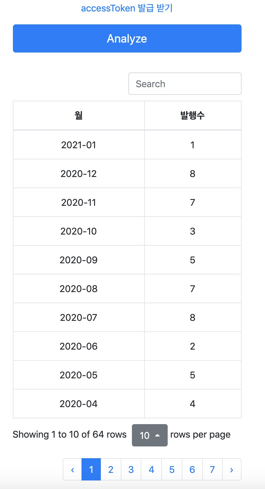

# Tistory Posts Per Month

[](https://app.netlify.com/sites/tistory-ppm/deploys)

티스토리 월별 글 발행수 조회기  
  
## Usage

[사이트](https://tistory-ppm.netlify.app/)에 접속한 뒤,  
아래처럼 본인의 블로그명 (```https://xxx.tistory.com```에서 xxx)과 AccessToken을 입력하고,  
Analyze 버튼을 누르면 


**월별 포스팅 수**를 가져온다.

